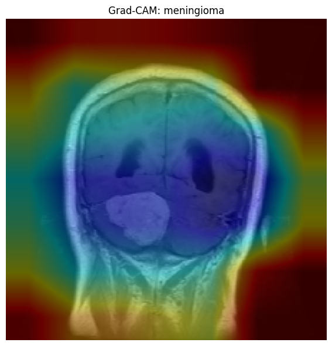

# 🧠 Brain Tumor Classification with CNNs

This project explores the use of deep learning to support MRI-based brain tumor diagnosis. Using three convolutional neural networks — MobileNetV2, EfficientNetB0, and VGG16 — the system was trained to distinguish between **meningioma**, **glioma**, **pituitary tumors**, and **no tumor** from T1-weighted MRI slices.

## 📈 Project Highlights

- Developed entirely in a **resource-constrained setup** (Google Colab + consumer laptop, no local GPU)
- Models were **fine-tuned with class weighting**, **early stopping**, and **light augmentation**
- Achieved **81% test accuracy** with MobileNetV2
- Employed **Grad-CAM** to visualize model attention and assess decision-making behavior
- Identified consistent model challenges in detecting **meningioma**, reflected in both metrics and interpretability

## 🔬 Interpretability Example

  
*Figure: MobileNetV2 attention focused correctly on tumor in meningioma case.*

Grad-CAM was applied to test images to examine where each model was "looking" when making predictions. Correct classifications showed attention centered on tumors, while misclassifications often showed dispersed or misplaced focus — especially for meningioma.

## 📄 Full Report

📘 [Read the full paper](Automated Brain Tumor Classification from MRI_ A Deep Learning Pipeline for Integrative Neuroimaging Research.pdf)

---

This work lays the foundation for future improvements in interpretability and model robustness, bringing us closer to clinically meaningful AI tools in neuro-oncology.
